# BahaAD 功能介紹

BahaAD 是「巴哈姆特動畫下載器」——但它不只是把影片抓下來。它是一個跑在你電腦上、
用電腦或手機瀏覽器都能操作的**動畫追蹤中心**：瀏覽番劇、一鍵訂閱、依官方週期表自動
下載新集數、解析官方公告調整排程、內建播放器、通知到 Telegram / Discord……

> 這份是「有哪些功能、長什麼樣子」的導覽。實際操作步驟見 [使用教學](使用教學.md)。

---

## 截圖說明

> ⚠️ 下面的截圖大多是**實際資料**（番劇封面、標題、集數、標籤、簡介、搜尋結果、排行清單、
> 播放的影片）——這些都是即時從動畫瘋抓的。
>
> 少數畫面為了呈現「功能長怎樣」用了**示範資料**，實際使用時以你自己的真實資料為準：
> **官方公告的公告事件、排程清單的「臨時異動」、排行榜的部分名次、番劇頁的訂閱數 / 觀看數、
> 下載列表的進行中 / 失敗卡片、集數格的下載中 / 失敗 / 已刪除狀態**——這些畫面下方都會標註。

---

## 1. 一個完整的網頁控制台

打開 BahaAD 後，瀏覽器會自動開啟控制台（預設 `http://127.0.0.1:5996`）。所有操作都在這裡，
不用改設定檔、不用背 sn 編號。

左側固定導覽列：**首頁**、**近期熱播**、**最新上架**、**搜尋番劇**、**官方公告**、
**新番快訊**、**訂閱列表**、**BahaAD 排行榜**、**下載列表**、**通知中心**、**設定**。

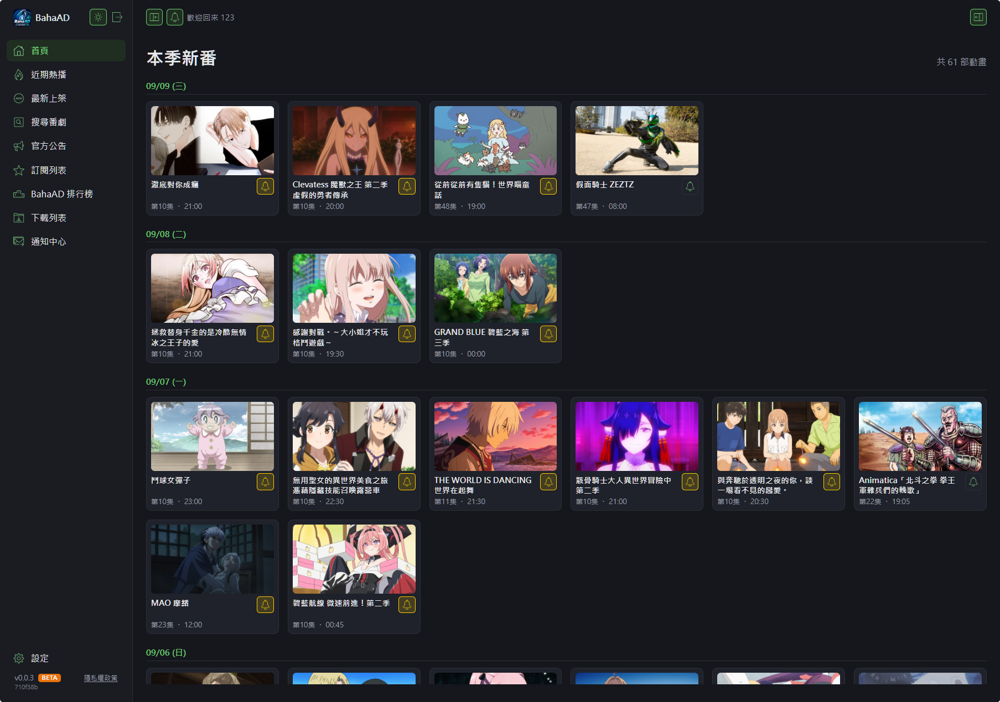

- 淺 / 深色主題切換、常駐系統匣。
- 網頁伺服器預設監聽區網，**同一個 Wi-Fi 下的手機**打開 `http://<電腦區網IP>:5996` 就能用
  同一組帳密登入管理。

---

## 2. 在 App 裡瀏覽與搜尋番劇

不用去動畫瘋複製網址。BahaAD 直接把官方各榜單搬進來：

| 頁面 | 內容 |
|---|---|
| **首頁** | 本季新番，依官方週期表分日排列 |
| **近期熱播** | 依月人氣排序的所有動畫，往下捲無限載入 |
| **最新上架** | 代理商新授權上架的番劇（上架日 / 最近更新 / 共 N 集） |

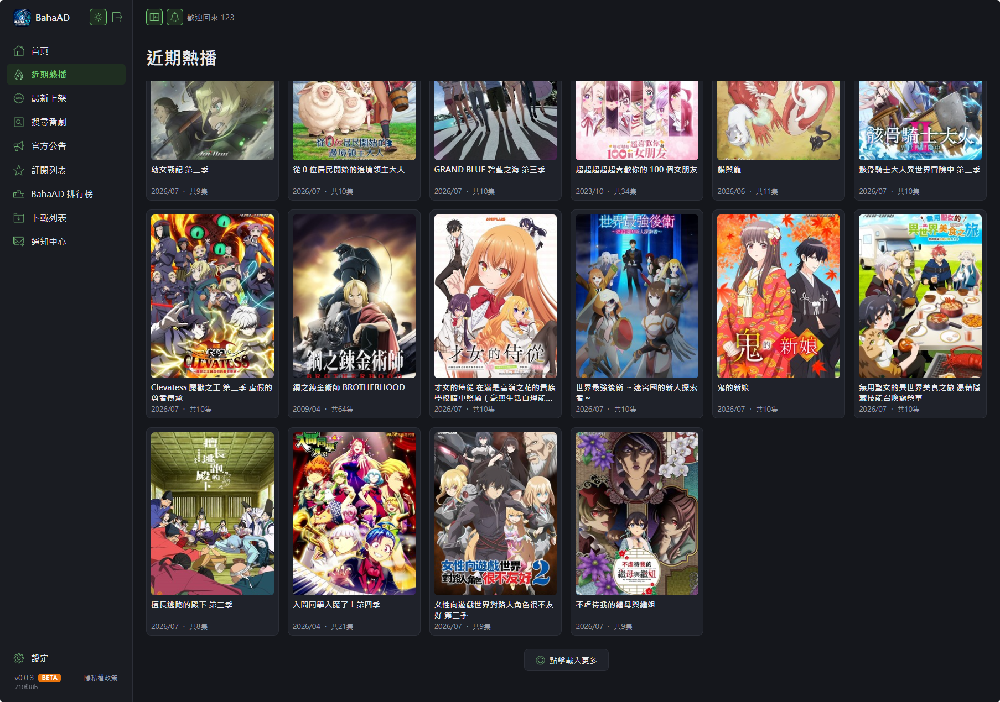

**搜尋番劇** 一個輸入框，三種輸入方式都能用：

- **番劇名稱關鍵字**（例：`無職轉生`）
- **番劇 sn**（直接跳到該番劇頁）
- **動畫瘋網址**（貼上 `ani.gamer.com.tw/animeVideo.php?sn=…` 直接解析）

右側還有**篩選面板**：37 種屬性標籤（最多選 5）＋類型（電影 / OVA / 雙語 / 泡麵番 / 真人演出）
＋對象（國家觀賞 / 付費會員 / 年齡限制）。

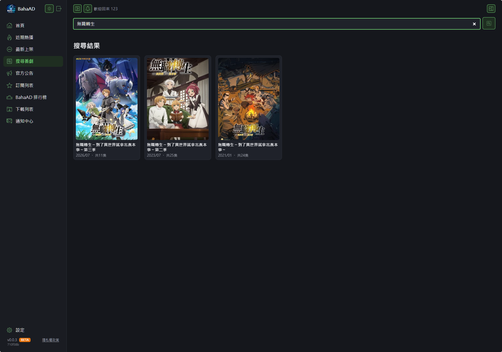

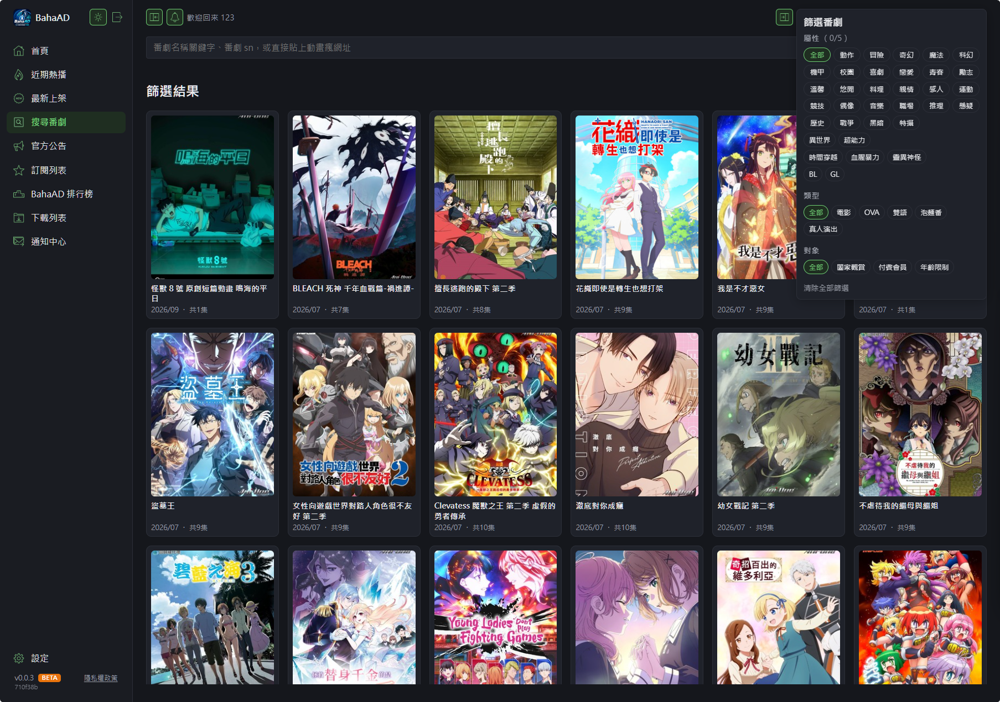

---

## 3. 番劇詳細頁

點任一張卡片進入詳細頁：封面、評價、首播日期 / 導演 / 代理 / 製作、**番劇標籤**（點一下就
以該標籤搜尋）、簡介、依官方分類排列的集數清單、相關動畫。

- **更改下載資料夾名稱**：點標題旁的按鈕，標題就地變成輸入框，改完 Enter 儲存——之後這部
  就下載到你取的名字，而不是站方原始標題。

  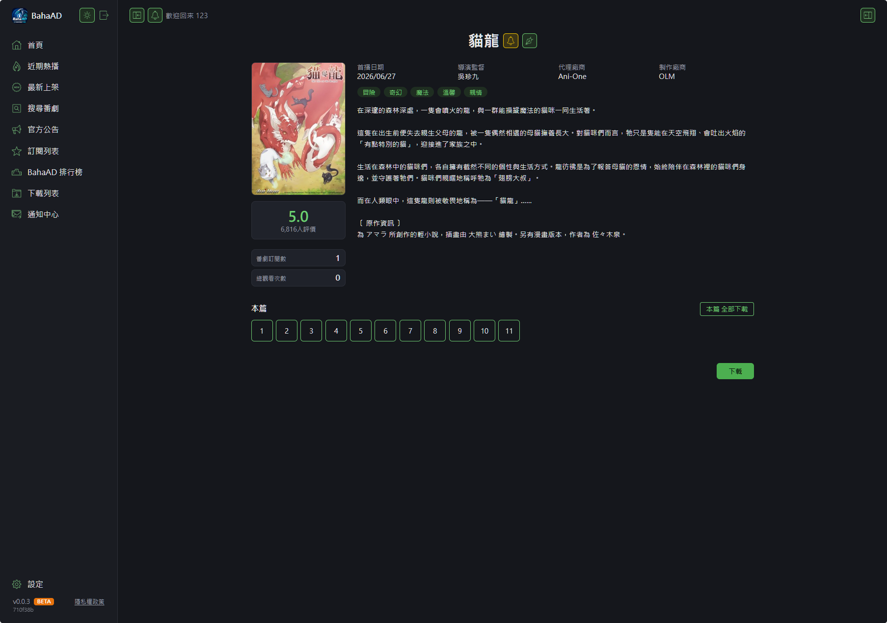

- **右側「製作資訊」面板**：動畫瘋本身沒有的**製作 / 配音 / 音樂**欄位，會從其他公開的
  動畫資料來源補上（原作 / 導演 / 作畫監督 / 動畫制作、角色↔聲優、片頭 / 片尾曲）。

  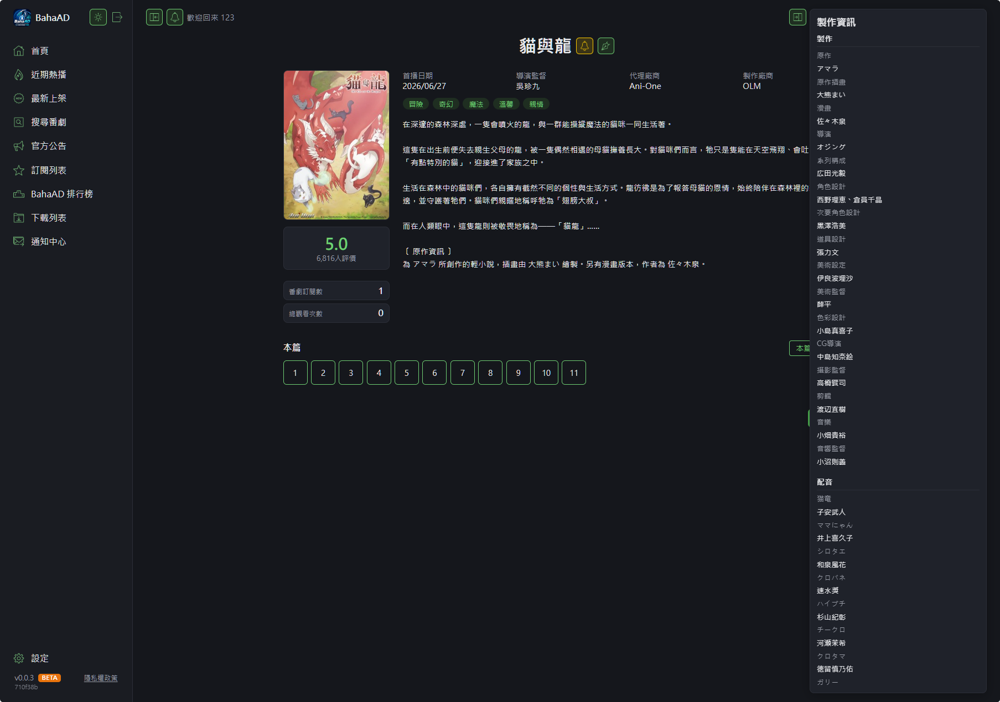
  此範例的曲名為示範字串，實際會顯示真實資料。

### 集數格的六種狀態

集數清單上一眼看出每一集的狀況：

| 外觀 | 意思 |
|---|---|
| 灰框 | 沒下載 |
| 琥珀框 | 正在下載 |
| 綠框 | 已下載 |
| 紅框 | 下載失敗 |
| 紫框 | 曾下載過、檔案已被移除 |
| 橘色實心 | 已下載且已看完 |

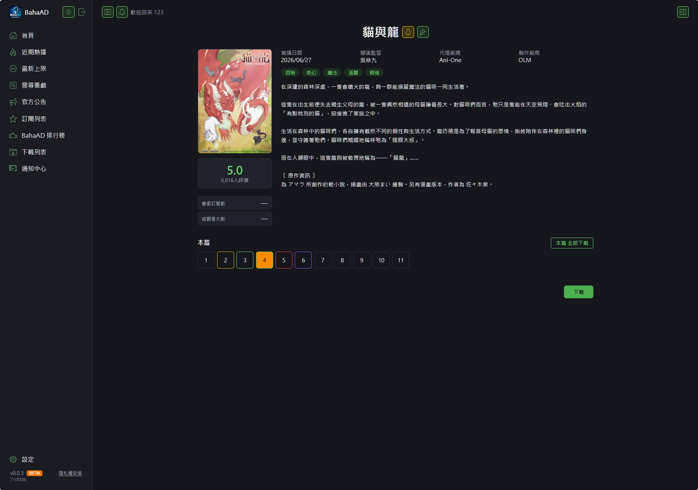
此圖的下載中 / 失敗 / 已刪除狀態為示範，鋪在真實集數上呈現。

---

## 4. 一鍵訂閱，依週期表自動下載

在番劇卡片或詳細頁點 **🔔 鈴鐺** 就訂閱了。之後 BahaAD 會**依官方週期表的時段**，在新集數
一上架就自動下載——不用自己盯。

**訂閱列表** 頁列出所有訂閱，右側可展開**排程清單**：每部番劇的播出星期時段、臨時異動
（延後 / 暫停）、以及「編輯」——在這裡設分類子資料夾、改名、自訂檢查時段。

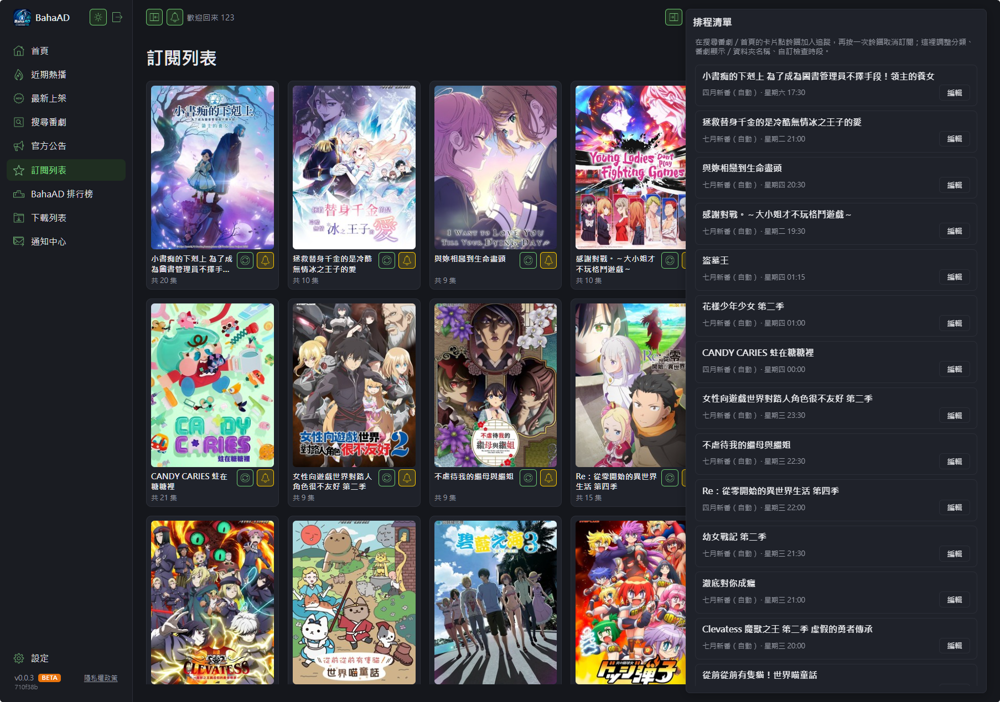
排程清單的「臨時異動」來自官方公告解析，此圖為示範資料。

- 每張卡片有 ⟳「重新檢查有沒有漏掉的更新」（單一）；頁面右上角有「重新檢查所有收藏」（全部）。
- 下載檔案自動歸到季別資料夾（例：`下載目錄/2026/07 七月新番/<番劇名>/`），也可以自己設分類。

---

## 5. 自動看懂官方公告

動畫瘋常常公告「本週停更」「延後至 XX:XX」「同時加更」「暫時下架」。BahaAD 會定期掃描
官方公告，**自動解析成五類**，並調整對應番劇的排程、（若有設定）發通知。

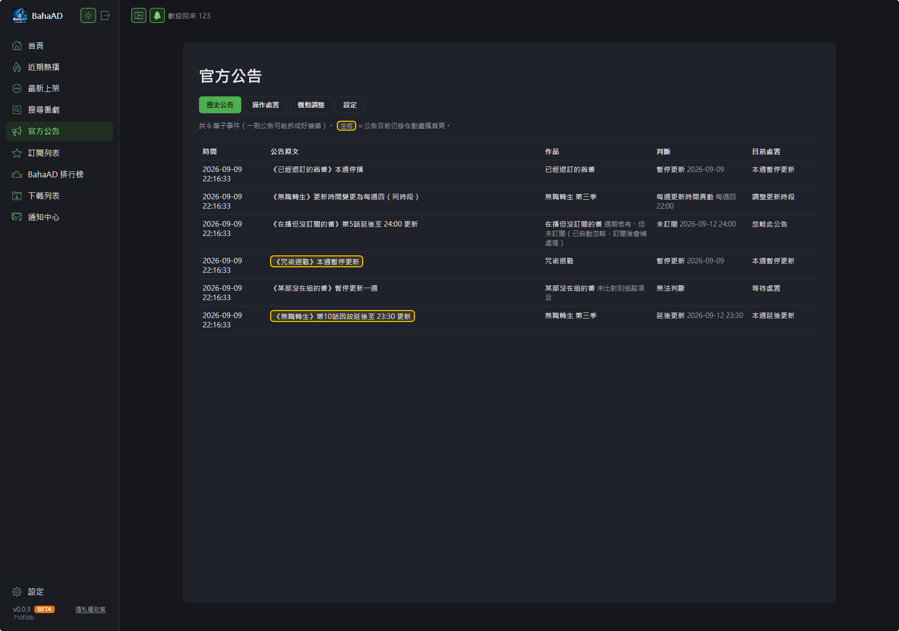
示範公告事件。

**操作處置** 分頁：每則公告一張卡，顯示系統判斷、預計時間、系統建議、對應追蹤項目，
你選「處置方式」按「套用處置」。

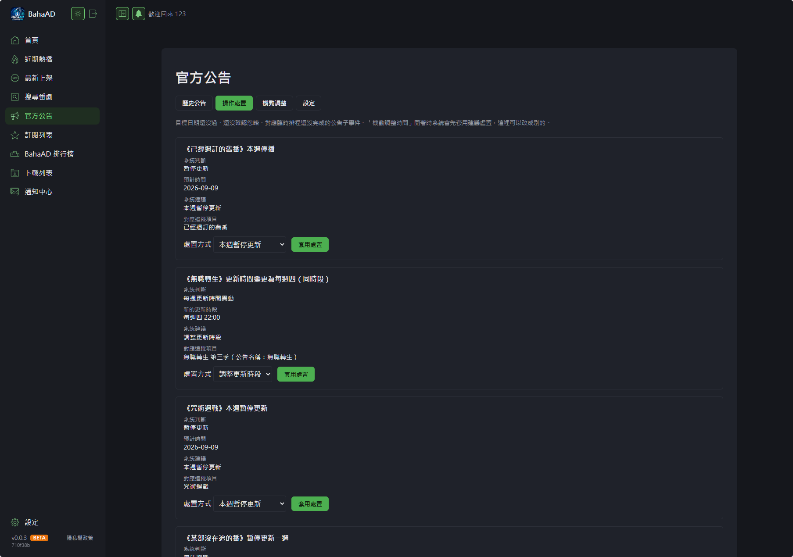
示範公告事件。

**番劇完結自動偵測**：訂閱的番劇連續一週從週期表消失、又沒有「下架」公告 → BahaAD 判定
它完結了，發通知並停止檢查。

---

## 6. 新番快訊

每季（1 / 4 / 7 / 10 月）動畫瘋發布下一季新番資訊時，BahaAD 會抓官方 GNN 文章整理成
「按星期 + 更新時間排序」的清單。每部可以「**追蹤**」——番劇真的上架後自動比對出集數編號，
把追蹤**轉成正式訂閱**並開始下載。

> ⚠️ 此功能尚未經過真實上架驗證（要等 2026 年 10 月秋季新番），使用時請留意行為可能與預期不符。

---

## 7. 內建播放器

已下載的集數，在番劇詳細頁點「▶ 播放」就地開浮層播放器——不用先去檔案總管找檔案。

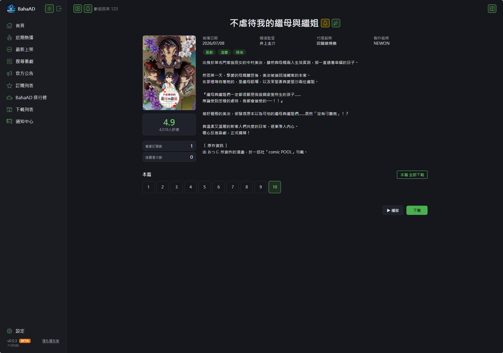

- 上一話 / 倒轉 10 秒 / 快轉 10 秒 / 下一話，方向鍵 ±10 秒。
- **播放進度記憶**：看到一半關掉，下次開同一集自動接續（每台瀏覽器各自記）。
- 播完自動接下一話。
- 網路狀態呼吸燈（綠 / 黃 / 紅）。
- 本機 / 區網直接串流；從外部（反向代理）連進來自動走 HLS。
- 有 AirPlay / Chromecast 裝置時出現「📺 投放」鈕。

---

## 8. BahaAD 排行榜

所有 BahaAD 使用者的**匿名彙總**、即時更新：番劇訂閱數、新番收藏數、番劇總觀看次數、
看完次數。滑鼠移到番劇名會浮出封面圖，點進去就是番劇頁。

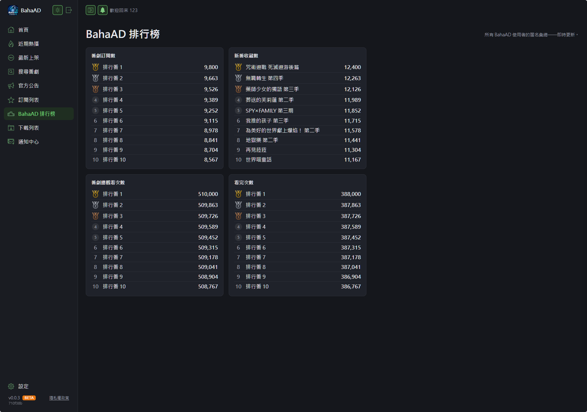
部分名次為示範資料；hover 封面圖為手動示範。

---

## 9. 下載佇列

**下載列表** 頁看得到：

- 進行中的下載即時進度（前置準備 / 下載中 % / 解密合併中）。
- 失敗項目顯示原因（未登入 / VIP 限定 / 連線逾時 / 站方維護…），可一鍵重試。
- 下載完成、檔案還沒搬進下載目錄的，可「再試一次」或「更改下載目錄」。

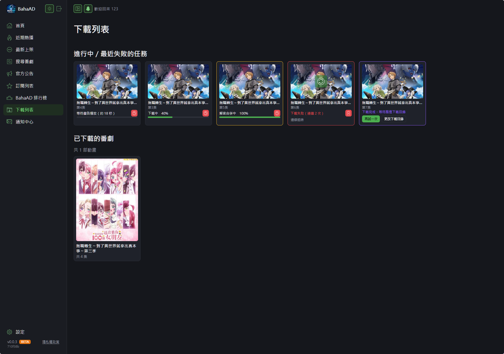
示範任務。

**下載影片**本身：在集數清單單選 / Ctrl 加選 / Shift 區間 / 拖曳選取，按「下載」，
（沒訂閱的番劇）填一次資料夾名稱，就送進佇列。

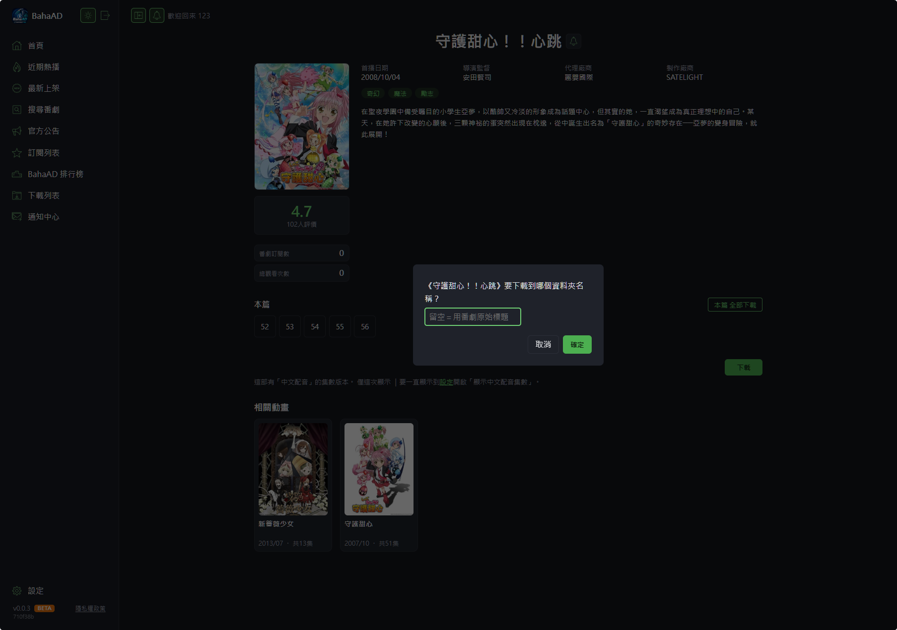

---

## 10. 通知到 Telegram / Discord

填 Telegram Bot Token + Chat ID，或 Discord Webhook URL。勾選要收哪些類別（下載完成 /
下載失敗 / 各類公告 / 番劇完結 / 有新版本）。**通知範本可自訂**，八個可編輯類別 + 預覽 +
還原預設。

通知內容只送到你自己設定的 Telegram / Discord，不經過任何第三方。

---

## 11. 手機版面

在手機瀏覽器（≤ 768px）開啟時，側欄改成**滑出式抽屜**（點左上角鈕滑出），番劇卡片自動排 2 欄，
內建播放器的按鈕排成適合觸控的一排。

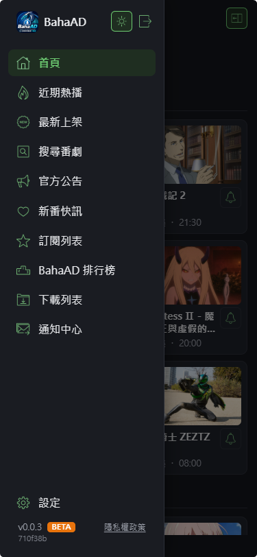

---

## 12. 線上自我更新

BahaAD 會定期查 GitHub Release。有新版時：

- **一般更新**：網頁顯示橫幅 + 提醒視窗，可「稍後再說」。
- 按「套用更新並重新啟動」→ 背景下載差異檔 → 小幫手程序重啟套用 → 這個分頁自動重新載入。

背景下載完成時，開著的分頁橫幅會即時換成「套用更新並重新啟動」，不用手動重新整理。

---

## 13. 隱私

- 帳號、密碼、2FA 密鑰、Cookie、瀏覽器指紋 → Windows DPAPI 加密、綁定你的 Windows 帳戶，
  存在你自己電腦上，不會離開這台電腦。
- 內建「錯誤自動回報」與「即時匿名使用統計」，兩者**預設開啟、各自獨立**，設定頁可分別關閉。
  回報 / 統計的欄位、以及**絕不**回報的內容，完整說明見
  [`docs/PRIVACY_POLICY.md`](PRIVACY_POLICY.md)。

---

## 附錄：截圖對照表（給維護者）

| 檔名 | 頁面 / 操作 |
|---|---|
| `img/01-home.png` | `/`——首頁，訂閱前 |
| `img/02-trending.png` | `/browse/trending`——捲到底顯示「點擊載入更多」 |
| `img/03-search-keyword.png` | `/browse/search`——輸入關鍵字後的結果 |
| `img/04-search-filter.png` | `/browse/search`——點右上角開啟篩選面板 |
| `img/05-anime-detail.png` | 任一番劇詳細頁 |
| `img/06-anime-rename.png` | 番劇詳細頁——點「更改下載資料夾名稱」 |
| `img/07-anime-staff.png` | 有製作資訊補充的番劇——展開右側「製作資訊」 |
| `img/08-episode-states.png` | 有多種下載狀態的番劇詳細頁集數清單 |
| `img/09-subscribe.png` | 首頁——訂閱幾部後，金 / 空心鈴鐺並存 |
| `img/10-subscriptions.png` | `/browse/subscriptions`——展開右側排程清單 |
| `img/11-gossip-history.png` | `/gossip/history`——歷史公告分頁 |
| `img/12-gossip-actions.png` | 官方公告——操作處置分頁 |
| `img/13-player.png` | 番劇詳細頁——播放已下載集數 |
| `img/14-leaderboard.png` | `/leaderboard` |
| `img/15-downloads.png` | `/browse/downloads` |
| `img/16-download-flow.png` | 選集數 →「下載」→ 資料夾名稱提問（可拼成一張或三張） |
| `img/17-mobile.png` | 手機尺寸（或瀏覽器縮到 ≤ 768px）——滑出抽屜 |
| `img/18-mobile-cards.png` | 手機尺寸——首頁，抽屜收合、番劇卡片排 2 欄 |

> 建議用**你自己實際使用中的 BahaAD**（真實訂閱、真實下載）截圖，資料最真實。
